**Team Project Journal**

# US-WEST-1A 🏖

# Project 🍔
# Weekly Progress and Challenges 
# Oct

# Week 1 (10/23/2018 - 11/3/2019)

## Minutes of meeting for team meeting
1) Gathered together to decide on the SaaS Application selection for the project.
2) Each member took one application and went throught the website during the meeting to get to know more about the project.
3) Divided the selected SaaS aplication into modules for each member to pick up
4) Design of the Application

## Task Assignment
1) Each Team Member- Go through the selected SaaS Application to get to know the website
2) Each Team Memner- Select module of your choice

## Blockers
None

## Outcome
1) Decided to go with The counter Burger Application
2) Each team member has its own module to work on

# Nov

# Week 2 (11/04/2019 - 11/10/2019)

## Minutes of meeting for team meeting
1) Team meet to gather requirements
2) Discuss on design and tools and technology for the application
3) Create Design Spec documents

## Outcome-
## Rudy
  - Created simple Payment REST api in golang
    GET get all payments
    GET get payment by id
    POST create new payment
    PUT edit payment
    DELETE delete payment by id

  - Also managed to connect to local mongodb.

## Arijit
  - Created Menu REST api in golang
    POST create an item in the menu
    GET get menu item bu Id
    GET get all menu items
    GET health check api
    
  - Also designed the database collection attributes
  - Tested the API's using Postman

## Manali
  - Create Restaurnat API design document
  - Create REST API for Restaurant in Golang
    POST create a new restaurant
    GET is used to get restaurant list based on zipcode
    DELETE to delete the restaurant
    PUT to update the restaurant

  - Create database design for the restaurant module

## Varun
  - Created User API desgin document. Which contains the details of all the api user module will have.
  - Understanding the restful standards and implementing .
  - Learning Golang for implementing the Gol mongodb

## Fulbert
  - Created Order API design document which will function as cart
  - Start creating a local mongodb for testing
  - Start working on REST API development

## Blockers
None as of now.

# Week 3 (11/11/2019 - 11/17/2019)

## Minutes of meeting for team meeting
1) Designing the database for the application.
2) Deciding on the frontend technology of the application.
3) Perform initial integration testing on the Various GO APIs.

## Outcome-

Front end - In React.js
Back end - Golang
Database - MongoDB with Sharding implemented

### Varun
  - Created database in mongodb.
  - Created Create user API.
  - Created Get user API.
  - Created Delete user API.
  - Created GetAll user API.

## Fulbert
  - Created a local mongodb for testing
  - Created Create order API
  - Created Get order by ID API
  - Creted Getall orders API

## Manali
  - Created database in mongodb
  - Created and tested GO Add restaurant API
  - Created and tested Get restaurant list API
  - Created and tested Delete restaurant API

## Arijit
  - Created database in mongodb
  - Created and tested GO add menu API
  - Created and tested menu delete API
  - Created and tested GO find menu API

## Rudy
  - Created database in mongodb
  - Created and tested GO get payments details by Id API
  - Created and tested GO create payment API
  - Created and tested GO add new payment API

## Challenges
1) Connecting React server with go API as it gives a CORS error.
2) Enabling cross origin request for Golang
3) MongoDB sharding creating issues when deleting or editing docuemnts
4) Bug fixes for Golang APIs

# Week 4 (11/18/2019 - 11/24/2019)
## Minutes of meeting for team meeting
1) Start Creating UI for individual module.
2) Making a bolier plate code for UI in React framework for each team member to follow.
3) Initial integration of one Golang API with the UI.

## Outcome

## Varun
  - Task division for UI module
  - MongoDB sharing implementation
  - Integration of create user APIs with client

## Fulbert
  - Task division for UI module
  - Created Create order API
  - Created Get order by ID API
  - Creted Getall orders API

## Manali
  - Task division for UI module
  - Sharding for MongoDB and testing 
  - Created and tested get all restaurant API

## Arijit
  - Task division for UI module
  - Created and tested GO update menu API
  - MongoDB sharding and testing with APIs

## Rudy
  - Task division for UI module
  - MongoDB sharding and testing
  - Created and tested Edit payment
  - Created and tested Delete payment

## Challenges

# Week 5 (11/25/2019 - 11/01/2019)
## Minutes of meeting for team meeting
1) Extensively starting working on UI and its bug fixes
2) To explore various WOW factors for the project
3) Designing the deployment for front end and backend

## Outcome

## Varun
  - UI development for User module
  - Understanding the working of ECS for GO service deployment
  - API bug fixes

## Fulbert
  - UI development for restaurant for order
  - Worked on integration of Menu and Order module
  - Order service deployment on Docker container on EC2

## Manali
  - UI development for restaurant
  - Integration testing of APIs with client
  - UI bug fixes.
  - Deploying GO APIs on docker container on EC2

## Arijit
  - UI development for Menu
  - GO API deployment on docker container on EC2
  - UI and backend Bug fixes and integration with Order

## Rudy
  - UI development
  - Deploying GO APIs on docker container on EC2
  - Working with Sharding replication and configuring on EC2

## Challenges
1) Health checks for ECS is failing resulting in draining of services

# Week 6 (12/01/2019 - 12/07/2019)
## Minutes of meeting for team meeting
1) Start integrating indvidual'd module with the UI
2) Performing testing on each module.
3) Testing the full flow for the application and writing test cases
3) Deploy backend services and front end on cloud and do integration testing

## Outcome

## Architecture Diagram
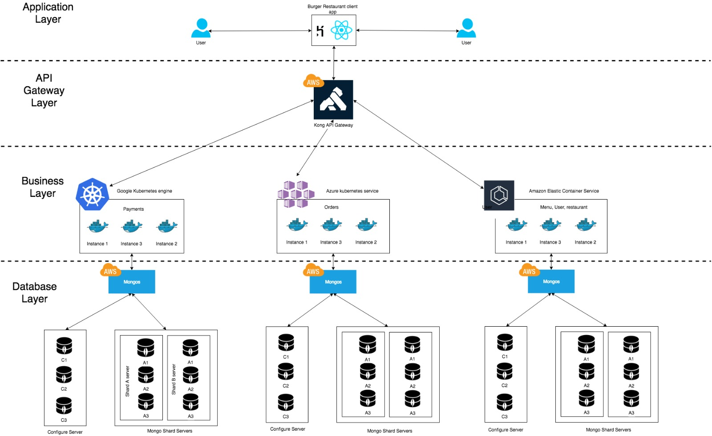

## Varun
  - Integrating UI if User with the system
  - Made necessary changes to incorporate User in every module
  - Deployment of GO services in ECS

## Fulbert
  - Integration of Client and backend for testing
  - Worked on deploying Golang app on Azure Cloud
  - Solved issues with ECS deployment of Health Checks

## Manali
  - Integration on Client and GO APIs and tested the whole flow of the application
  - UI testing and bug fixes for Restaurant and Menu module
  - Solving Redux issues for React
  - Deployment of GO server APIs on ECS

## Arijit
  - UI and Backend Integration of Menu and connecting with Restaurant
  - Worked on AWS API gateway and integrating every module with .
  - GO API deployment on ECS
  - UI and backend Bug fixes.

## Rudy
  - Integrated Payments client with GO APIs and Integration testing of the application
  - Setup the redux payment store
  - Deployed golang app on AWS ECS
  - Deployed golang app on Google GKE

## Challenges
1) Sharding is not properly distributed, need to pick the correct sharded key.
2) AWS ECS keeps stopping, it turned out, the health check was not properly configured.
3) Client deployment on Heroku was giving SSL issue on deployment which was later fixed and the application is running fine now
4) AWS API gateway is returning every request with status of 200 Ok even if the request failed at the backend

# !!!**WOW Factor**!!!

## Amazon EC2 Container Service
Amazonm ECS is a container service which is used to deploy services on a group of servers forming a cluster. ECS deploys docker container for distributed applications. It also evaluates the CPU usage and memory consumptions to determine the deployment requirements of a container. It used Appliation load balancer internally.

We have deployed our 3 microservices (User, Restaurant and Menu) on ECS.

## Google Kubernetes Engine (GKE)

We have deployed out 1 microservice (Payment) on Google GKE

## Azure Kubernetes Service (AKS)

We have deployed our 1 microservices (Order) on Kubernetes on Azure

#  AKF Scale Cube

## X Axis - Horizontal Duplication
We are achieving horizontal replication for each of the servic end points by creating multiple nodes of each microservice. We have our users, menu and orders scaled on ECS and payment, orders on Kubernetes cloud.

Showing scaling for Menu service ping

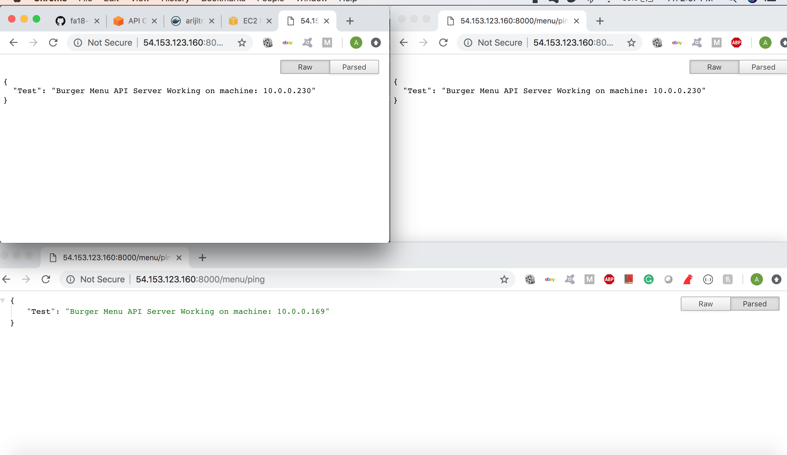

Figure: Showing horizontal replication of the menu service (evident from different IP addresses)

## Y Axis - Split by function service
Our application contains 5 microservices i.e. User, Restaurant, Menu, Order, Payment. If any one of the microservice is taken down then it won't affect other service.

## Z Axis - Sharding
All of our microservices have a MongoDb sharded database with 2 shard replica cluster of 3 nodes each.

Steps for testing sharding 
1) Test consistency of data by inserting into primary and getting the documents from secodary. 
2) Isolate one secondary server from the other servers in the cluster and test reading stale data
3) Connecting up the server again to the cluster and test replication again

Figure: Showing shard clusters settings in config server

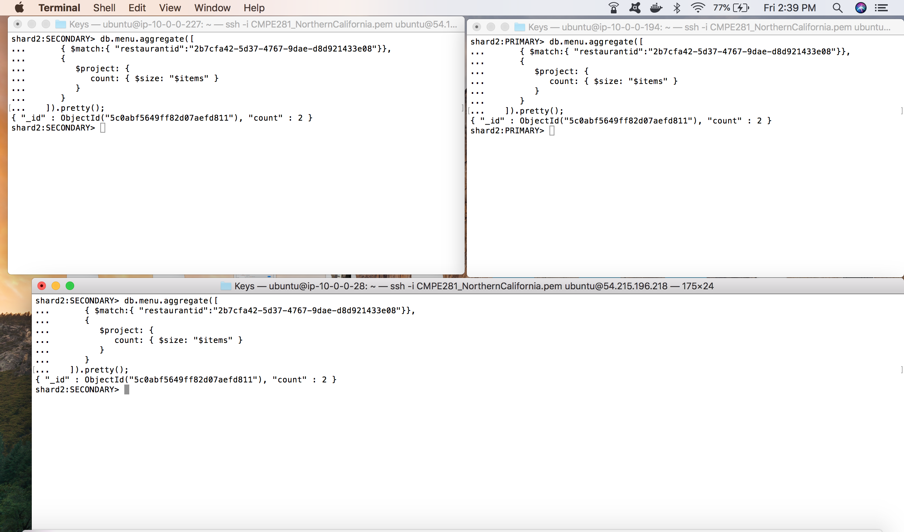

Figure: Consistency in  shard cluster(shard2) before partition

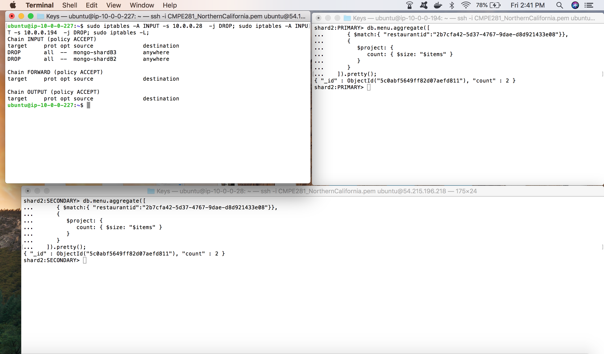

Figure: Creating network partiotion in secondary node (top left) using IP Tables

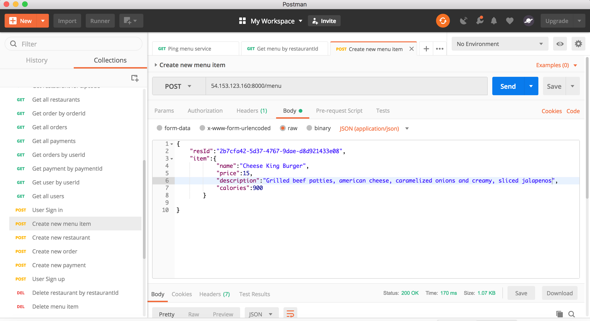

Figure: Inserting a new item in the menu after creating partition

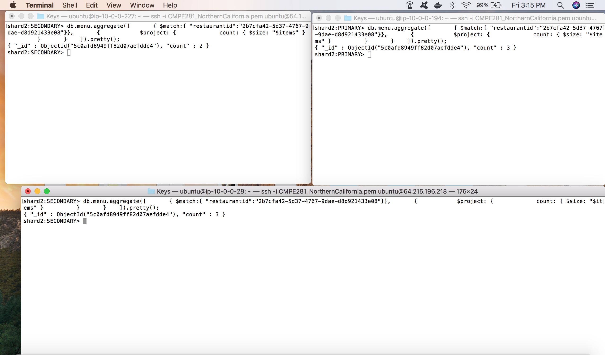

Figure: Showing stale data read (document count) in the isolated (network partitioned) node

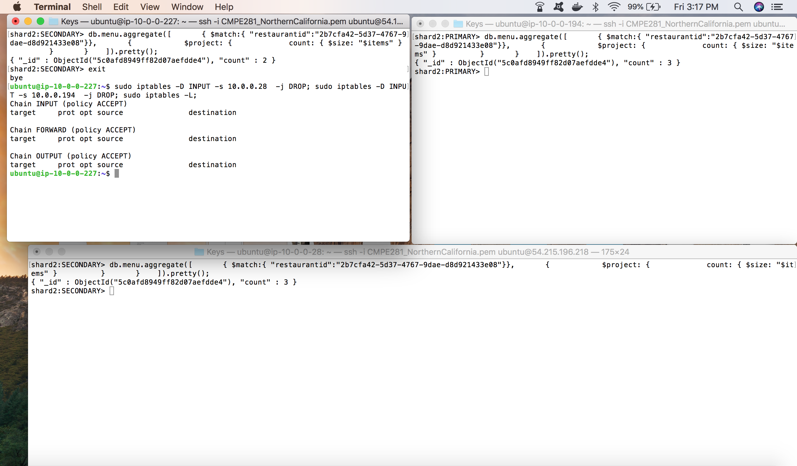

Figure: Removing network partition by deleting IP Table rules

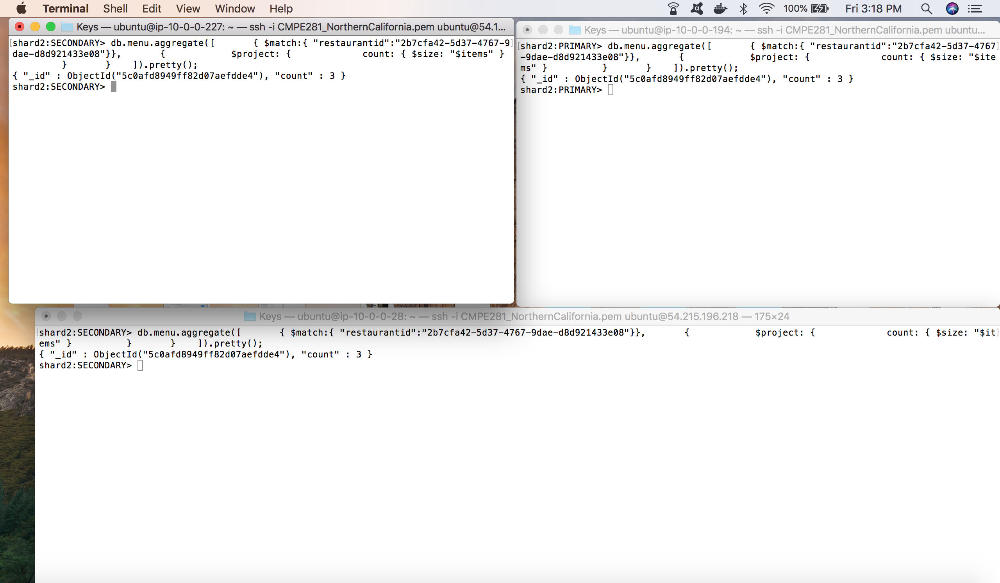

Figure: All the shard nodes are eventaully consistent with same data (document count)

# Demonstrating our application's ability to handle a network partition

1) A user is logged in.
2) The user has some items in the cart.
3) Taking down the payment service.
4) The user is not able to pay for the order but he can navigate back in the appliation and search for new items and add it to cart.

5) Once the payment service is working, user can proceed by paying for the items in the carts

 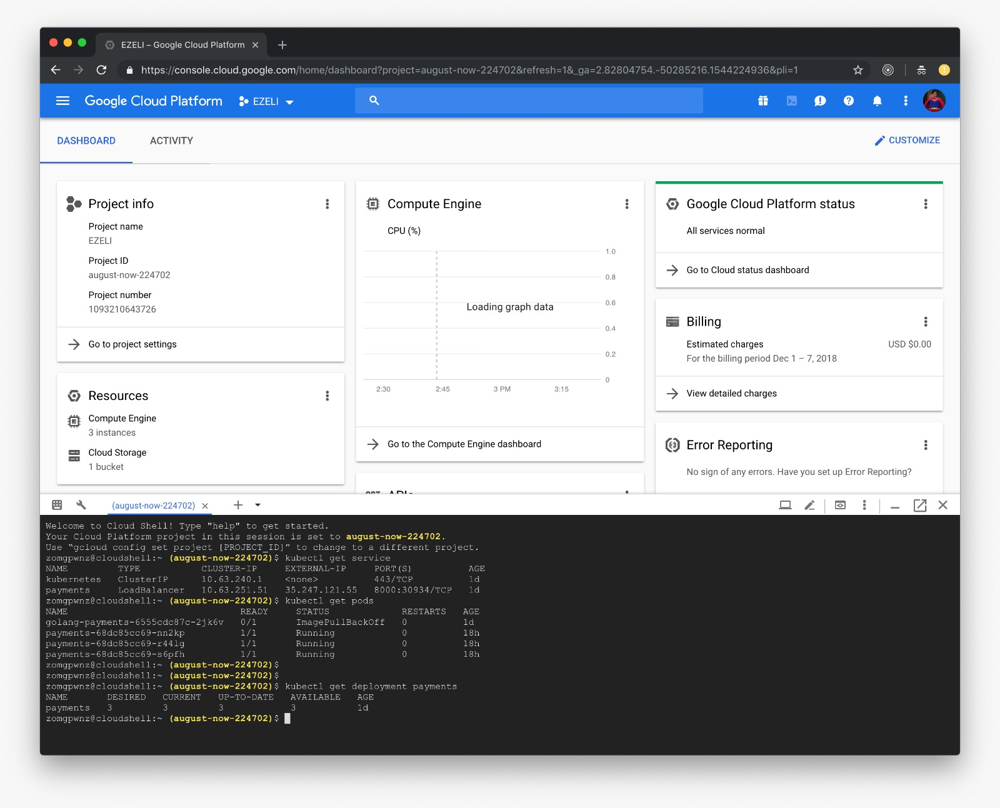

Figure: Showing payment service running in google kubernetes

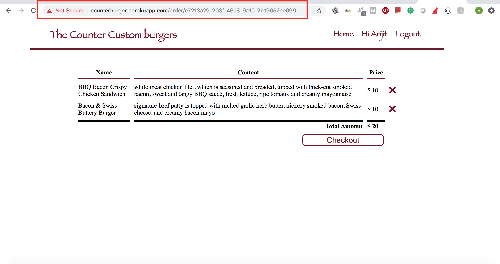

Figure: User adding items in the cart

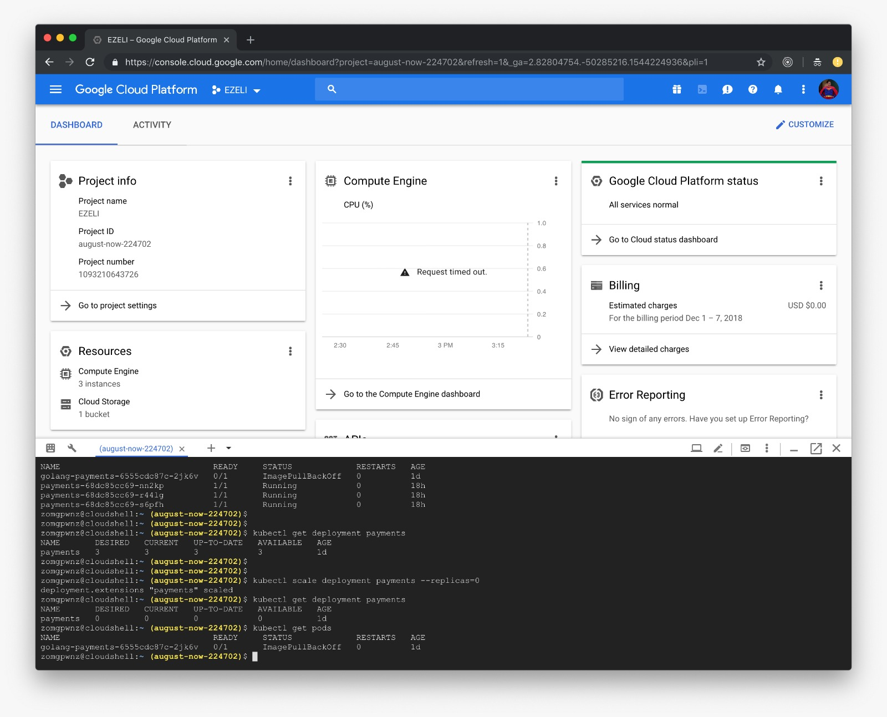

Figure: Taking down payment service by sacling down to zero

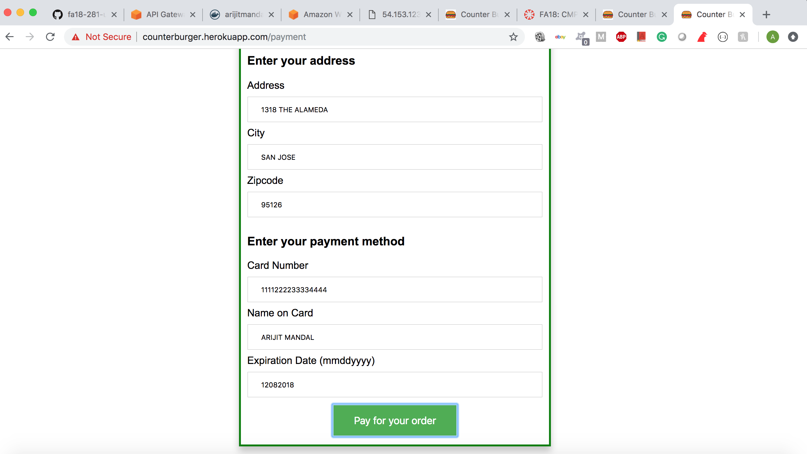

Figure: User requested for payment service

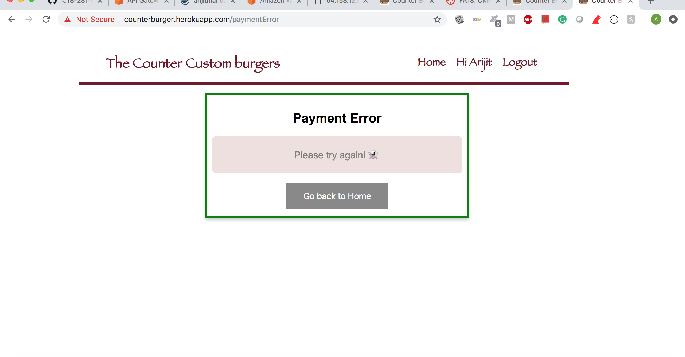

Figure: Payment service not working 

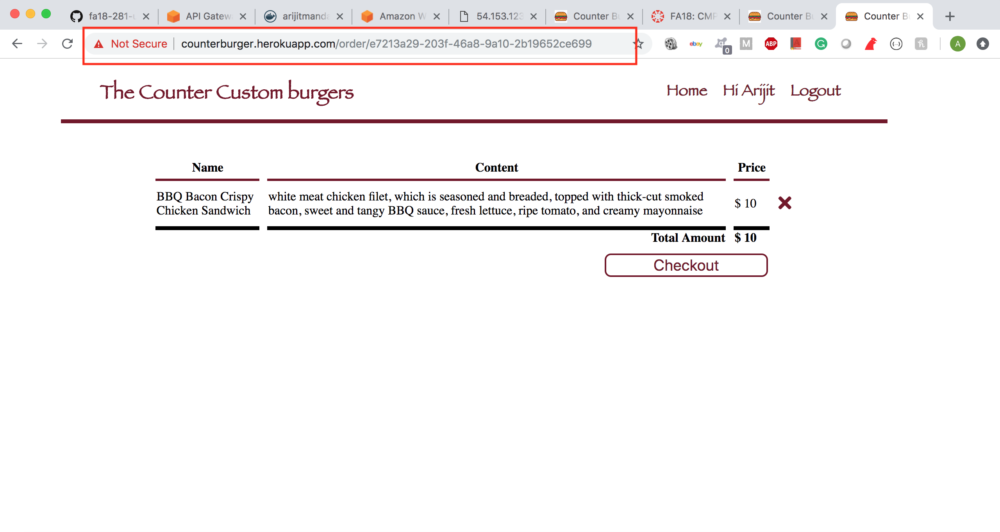

Figure: Even though payment service is not working, user can edit order using order service (item removed)

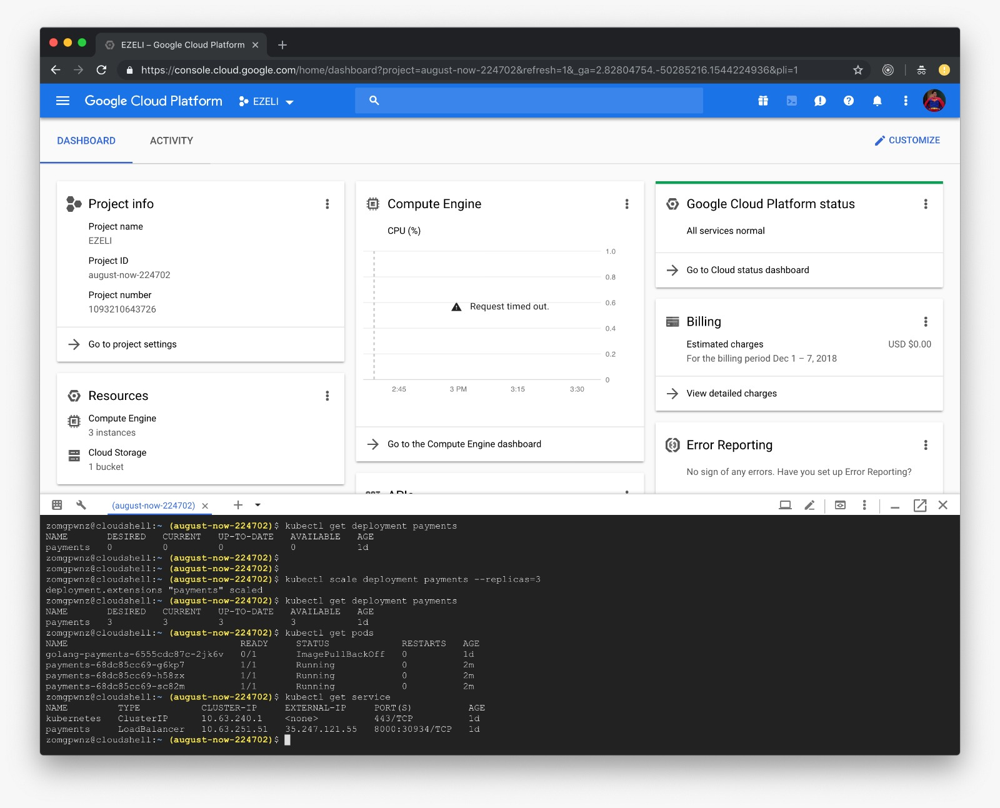

Figure: Restarting payment service

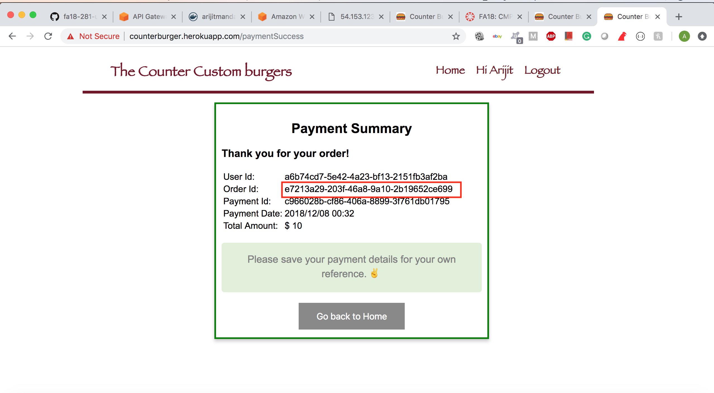

Figure: Paying for the existing  (order) in the cart (success) 

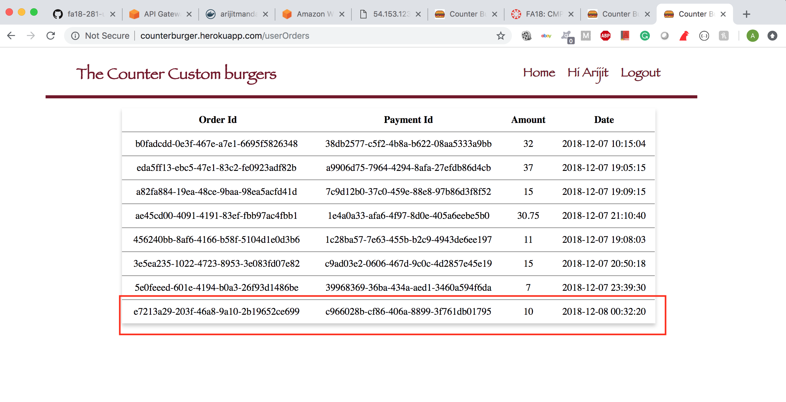

Figure: Trace of payment and order in user profile

# Testing 

## Application Flow

##### 1) Find restaurants by entering zipcode

##### 2) Getting list of all the restaurant

##### 3) Get menu items for a particular restaurant

##### 4) Adding menu items to cart

##### 5) Processing oder by clicking on item cart

##### 6) Checkout items

Error: You cannot process to payment for the order untill you login

Success: Redirect to login page

##### 7) Payment page for ordering burger

##### 8) See all the orders for a user

