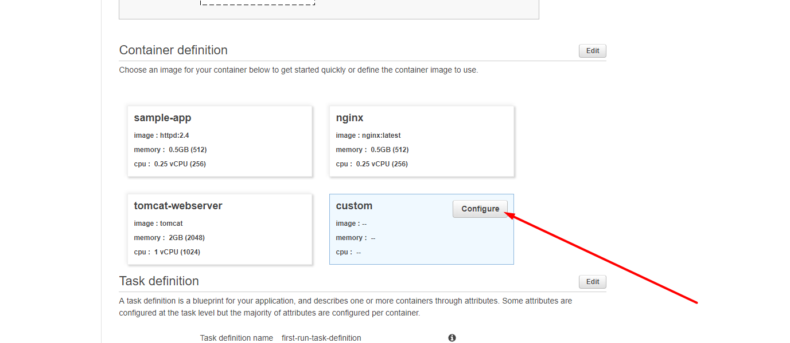
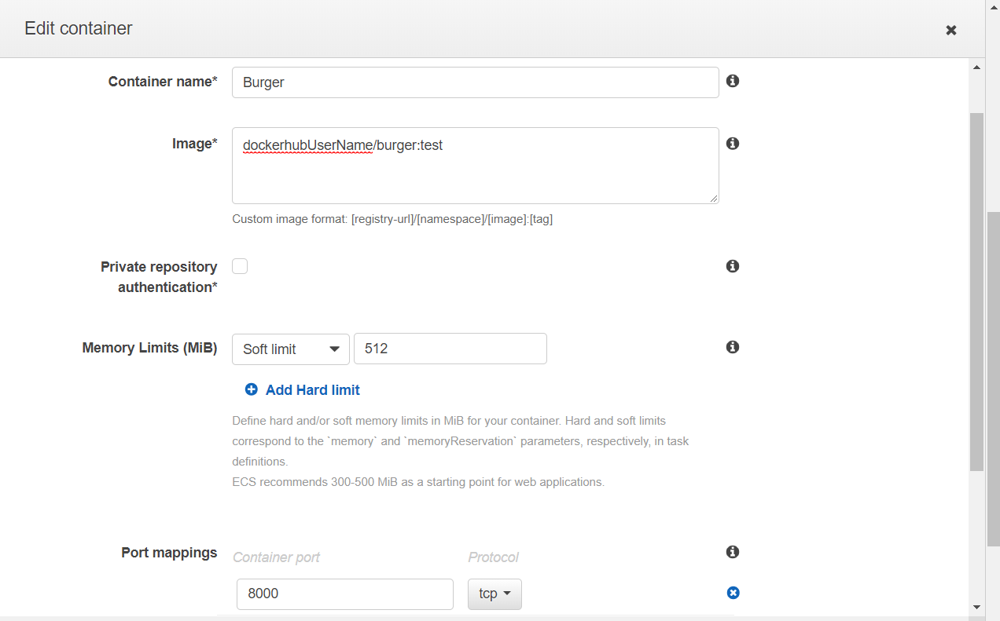
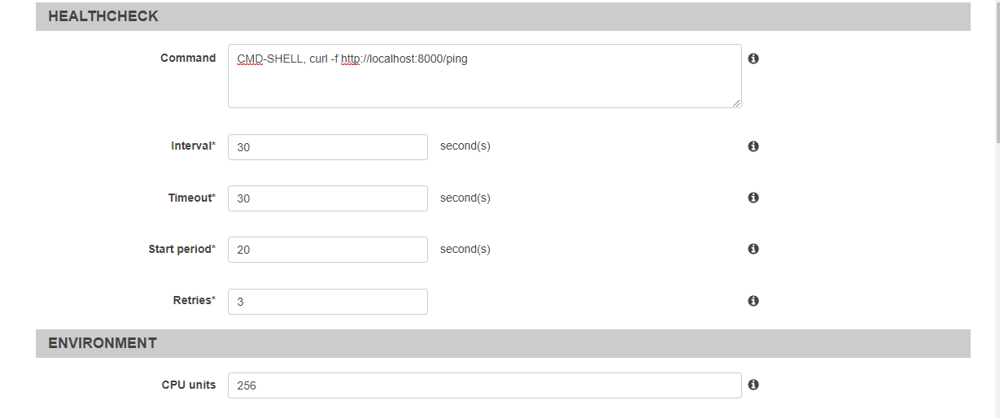
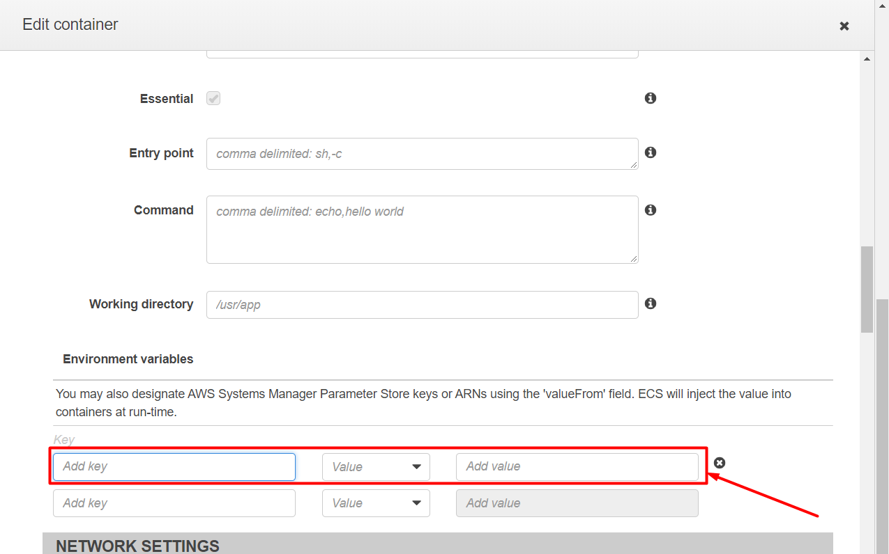
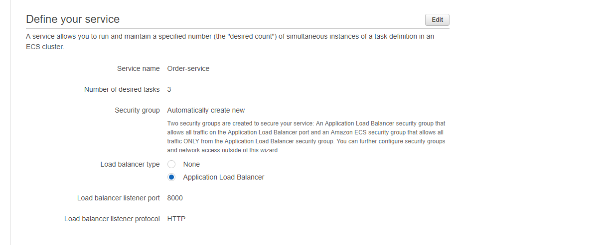
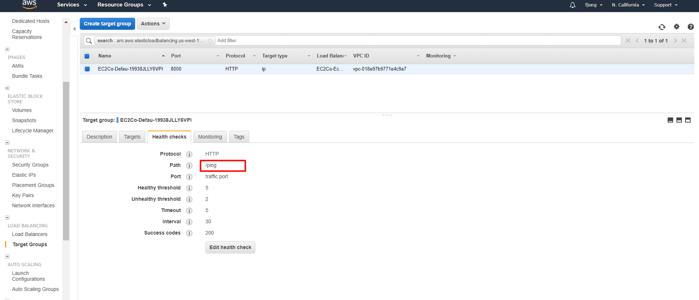
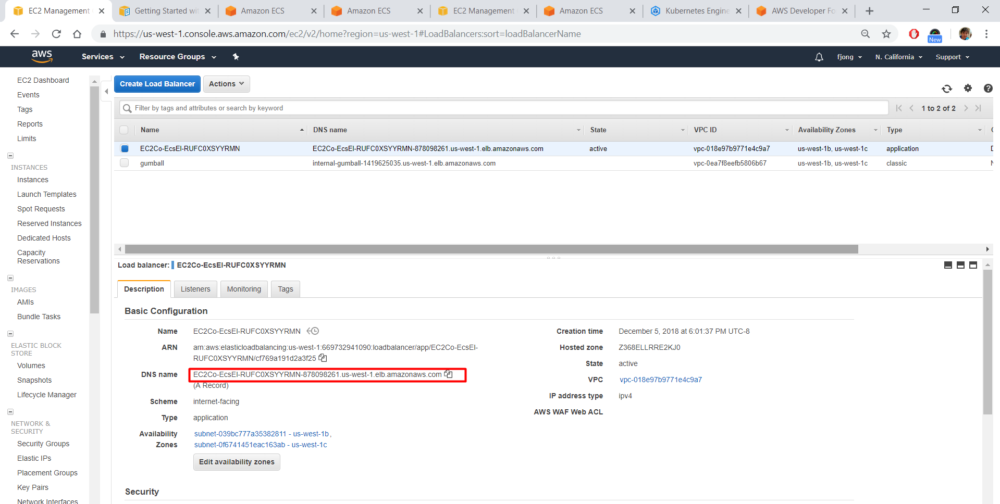

# GOLANG REST API for restaurant microservice

## Running GOLANG API locally

#### 0. Open a terminal

#### 1. Set your GOPATH to the project directoy

``` 
export GOPATH="Your Project directory"
```

- Note you might need to setup your environment before running the API

#### 2. Build your app
```
go build restaurant
```

#### 3. Run the app from terminal
```
./restaurant
```

#### 4. See where the app runs
```
[negroni] listening on :8000
```
#### 5. Test APIs using postman
```
Try ping the API

curl -X GET \
  http://localhost:8000/restaurant/ping \
  -H 'Postman-Token: ceca2e35-2963-4bd8-9a41-6504f9186f78' \
  -H 'cache-control: no-cache'

{
    "Test": "Burger Restaurant API Server Working on machine: 10.0.0.164"
}

```

## Running the GO API in EC2 using docker

#### 1. Install Docker 

#### 2. Start Docker
```
sudo systemctl start docker
sudo systemctl is-active docker
```

#### 3. Login to your docker hub account
```
sudo docker login
```

#### 4. Create Docker file 
```
sudo vi Dockerfile

FROM golang:latest 
EXPOSE 8000
RUN mkdir /app 
ADD . /app/ 
WORKDIR /app 
ENV GOPATH /app
RUN cd /app ; go install restaurant
CMD ["/app/bin/restaurant"]
```

#### 5. Build the docker image locally
```
sudo docker build -t restaurant .
sudo docker images
```

#### 6. Push docker image to dockerhub
```
docker push restaurant:latest
```

#### 7. Create Public EC2 Instance

Configuration:
1. AMI:             CentOS 7 (x86_64) - with Updates HVM
2. Instance Type:   t2.micro
3. VPC:             cmpe281
4. Network:         Public subnet (us-west-1c)
5. Auto Public IP:  Yes
6. SG Open Ports:   22, 80, 8080, 3000, 8000
7. Key Pair:        cmpe281-us-west-1

#### 8. ssh to your ec2 instance, user name is centos

#### 9. Create docker-compose yml file (with the environment variables set up)

#### 10. Deploy go API for order sevice
```
docker-compose up
```

#### 11. Clean Up docker environment when finished
```
docker stop restaurant
docker rm restaurant
docker rmi {imageid}
``` 

## Configuring Mongo Shard
#### 1. ssh to the querry-router instance for shard cluster

#### 2. Login to mongo shell
```
mongo mongo-router:27017 -u mongo-admin -p --authenticationDatabase admin
pass: yourpassword
use burger
db.restaurant.getShardDistribution()
```

#### 3. Use burger database
```
use burger
```

#### 4. Enable Sharding
```
sh.enableSharding("burger")
```

#### 5. Select shard key for your collection
```
db.users.ensureIndex( { restaurantId : "hashed" } )
sh.shardCollection( "burger.restaurant", { "restaurantId" : "hashed" } )
```

#### 6. Get the shard distribution
```
db.restaurant.getShardDistribution() 
```

## Amazon ECS

#### 0. Use the wizard to create an ecs cluster 
```
https://us-west-1.console.aws.amazon.com/ecs/home?region=us-west-1#/firstRun
```

#### 1. Select configure custom image



#### 2. Configure your cluster's name, image, and port mapping


#### 3. Configure your Health Check 


#### 4. Configure your environment variables


#### 5. Leave Everything else as default and update

#### 6. Define Your Service


#### 7. Create Your Cluster

#### 8. Go to EC2 Target Groups and configure your health check


#### 9. Go to your loadbalancer and test your API endpoint
